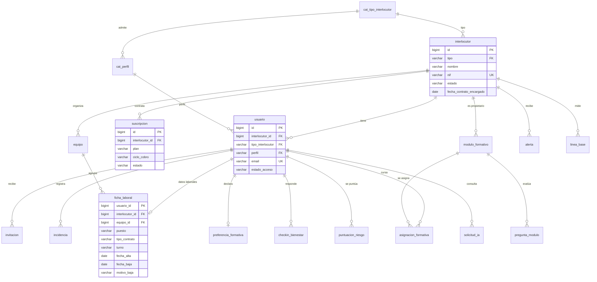

# Modelo de datos · Pyme Hub

**Motor:** MySQL 8.4 LTS · InnoDB · `utf8mb4_0900_ai_ci` · fechas en UTC
**Migraciones de referencia:** `migrations/0001_esquema_inicial.sql` y `migrations/0002_equipo_nombre_vigente.sql`

## 1. Principio: interlocutor y usuario

Todos los **actores** del sistema están en la tabla `interlocutor` y se distinguen por `tipo`. Las **personas** que acceden (o pueden llegar a acceder) están en `usuario` y se distinguen por `perfil`. Un interlocutor tiene varios usuarios.

| `interlocutor.tipo` | Qué representa | Perfiles de `usuario` admitidos |
|---|---|---|
| `PLATAFORMA` | Pyme Hub como operador. Existe un único registro | `ADMIN` |
| `EMPRESA` | PYME cliente | `GERENTE`, `RRHH`, `EMPLEADO` |
| `FORMADOR` | Formador externo de Pyme Hub Skills (fase 2) | `FORMADOR` |

Ejemplo: la empresa «Reparto Rápido Castilla S.L.» es un interlocutor `EMPRESA` con una gerente (`GERENTE`), una responsable de personas (`RRHH`) y 48 conductores y mozos (`EMPLEADO`).

### Cómo lo garantiza la base de datos (sin triggers)

1. **Tipos y perfiles en catálogos.** `cat_tipo_interlocutor` lista los tipos y `cat_perfil` lista qué perfiles admite cada tipo. Añadir un tipo o un perfil es insertar una fila, no cambiar el esquema.
2. **El perfil debe corresponder al tipo.** `usuario` guarda una copia de `tipo_interlocutor` atada por dos claves foráneas compuestas:
   - `(interlocutor_id, tipo_interlocutor) → interlocutor (id, tipo)`: la copia siempre coincide con el tipo real.
   - `(tipo_interlocutor, perfil) → cat_perfil`: el perfil está permitido para ese tipo.

   Así, un usuario `ADMIN` en una `EMPRESA` o un `EMPLEADO` en la `PLATAFORMA` son imposibles a nivel de base de datos, y cambiar el tipo de un interlocutor que ya tiene usuarios también.
3. **Una sola plataforma.** Una columna generada (`plataforma_unica`) con índice único impide un segundo interlocutor `PLATAFORMA`.
4. **Una sola suscripción vigente por empresa**, con el mismo mecanismo (`vigente_unica`). También el **nombre de equipo** es único solo entre los equipos vigentes (`nombre_vigente`, migración 0002), para poder reutilizar el nombre de un equipo borrado.
5. **Aislamiento entre empresas.** Las tablas de negocio llevan `interlocutor_id` y sus claves foráneas son compuestas (`usuario_id, interlocutor_id`): es imposible, por ejemplo, registrar un check-in de un empleado con el `interlocutor_id` de otra empresa.
6. **Una cuenta activa siempre tiene credenciales**: `CHECK (estado_acceso <> 'ACTIVO' OR (email IS NOT NULL AND password_hash IS NOT NULL))`.

### Empleados con y sin cuenta

Un empleado puede existir antes de tener acceso (por ejemplo, tras importar la plantilla por CSV): es un `usuario` con perfil `EMPLEADO` en estado `SIN_ACCESO`. Al invitarle pasa a `INVITADO` y, al aceptar, a `ACTIVO`. Sus datos laborales están en `ficha_laboral` (1:1), separados de los datos de acceso:

| `usuario.estado_acceso` | Significado |
|---|---|
| `SIN_ACCESO` | Existe en la plantilla, sin cuenta |
| `INVITADO` | Tiene una invitación pendiente |
| `ACTIVO` | Puede iniciar sesión |
| `BLOQUEADO` | Acceso suspendido por la empresa |
| `BAJA` | Sin acceso por baja. En un empleado, la baja laboral se registra en `ficha_laboral` (`fecha_baja` y `motivo_baja`: `VOLUNTARIA`, `NO_VOLUNTARIA`, `FIN_CONTRATO`) y el usuario se conserva para medir la rotación |

## 2. Diagrama

## 3. Tablas

| Tabla | Propósito | Notas |
|---|---|---|
| `cat_tipo_interlocutor` | Tipos de actor | `PLATAFORMA`, `EMPRESA`, `FORMADOR` |
| `cat_perfil` | Perfiles admitidos por tipo | |
| `interlocutor` | Todos los actores | Estado `PILOTO`, `ACTIVO`, `SUSPENDIDO`, `BAJA` |
| `suscripcion` | Plan y ciclo de cobro de una empresa | Histórico; una vigente |
| `usuario` | Personas con perfil | Email único global; contraseña Argon2id |
| `invitacion` | Enlaces de un solo uso | Solo se guarda el hash SHA-256; 72 h |
| `equipo` | Equipos de la empresa | Nombre único entre los vigentes; no se borra si tiene empleados de alta |
| `ficha_laboral` | Datos laborales del empleado | `motivo_baja` permite medir la rotación voluntaria |
| `incidencia` | Ausencias injustificadas, retrasos, siniestros, quejas, reconocimientos | Sin bajas médicas (LEG-012) |
| `modulo_formativo` | Micro-módulos | El propietario es un interlocutor: plataforma = catálogo global |
| `pregunta_modulo` | Cuestionario | 2–4 opciones |
| `asignacion_formativa` | Formación de cada empleado | Origen: gestión, autoinscripción o asesor de IA |
| `preferencia_formativa` | Preferencias para el asesor | Solo las ve el empleado (LEG-014) |
| `checkin_bienestar` | Check-in diario | Nota cifrada; equipo guardado en el momento del check-in |
| `puntuacion_riesgo` | Score de rotación | Histórico con factores y versión de reglas |
| `alerta` | Alertas de rotación, bienestar y formación | |
| `linea_base` | Rotación y absentismo previos al alta | RF-037 |
| `solicitud_ia` | Registro de consultas al asesor | Sin contenido; solo hash |
| `registro_auditoria` | Acciones sensibles | Solo inserción |
| `limite_peticion` | Limitación de peticiones | |
| `migracion_esquema` | Versiones aplicadas | La crea el migrador |

## 4. Convenciones

- Nombres de tablas y columnas en español, en minúsculas y singular.
- Valores enumerados en mayúsculas y validados con `CHECK` (o catálogo si deben poder ampliarse sin migración).
- Todas las fechas y horas en UTC; la conversión a `Europe/Madrid` la hace el frontend.
- Borrado lógico con `eliminado_en` donde hace falta conservar el histórico.
