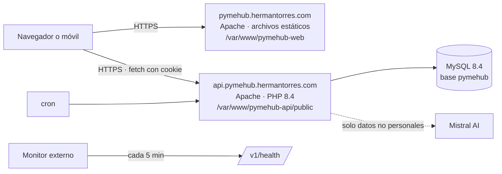

# Manual 01 · Despliegue de Pyme Hub

**Aplica a:** `pymehub_api` 0.1.0 y `pymehub_web` (cuando esté disponible)
**Entorno:** VPS Hostinger · Debian 13 · Apache 2.4 · PHP 8.4 · MySQL 8.4 LTS · sin Docker
**Dominios:** `api.pymehub.hermantorres.com` (API) y `pymehub.hermantorres.com` (web)
**Última revisión:** 03/10/2026

---

## 1. Qué cubre este manual

Este manual lleva Pyme Hub desde un servidor que ya aloja otros sitios hasta tener la API y la web publicadas con HTTPS, copias de seguridad y monitorización. Está escrito para ejecutarse por SSH con un usuario con `sudo`.

Las reglas que se respetan en todo el proceso:

- No se modifica ningún vhost, base de datos ni configuración global que pertenezca a otro sitio del servidor (`RNF-001`).
- Los secretos (contraseñas, claves) solo viven en el servidor, nunca en los repositorios ni en el chat.
- Cada paso termina con una comprobación. Si la comprobación falla, no se continúa.

Los comandos usan estos valores; cámbialos si los tuyos son distintos:

| Variable | Valor |
|---|---|
| Ruta de la API | `/var/www/pymehub-api` |
| Ruta de la web | `/var/www/pymehub-web` |
| Usuario de despliegue | `pymehub` |
| Base de datos y usuario MySQL | `pymehub` / `pymehub_user` |

---

## 2. Arquitectura del despliegue



La web no tiene código de servidor: solo descarga HTML, CSS y JavaScript, y todo lo demás lo pide a la API.

---

## 3. Requisitos previos

- [ ] Acceso SSH al VPS con un usuario con `sudo`.
- [ ] Acceso al panel DNS de GoDaddy de `hermantorres.com`.
- [ ] Acceso de lectura a los repositorios `hermantorreshyo/pymehub_api` y `hermantorreshyo/pymehub_web`.
- [ ] Una copia de seguridad reciente del servidor (panel de Hostinger → *Snapshots*) antes de empezar.

---

## 4. Paso 0 · Comprobar el motor de base de datos (bloqueante)

Pyme Hub exige **MySQL 8.4 LTS**. Debian 13 trae MariaDB en sus repositorios, y **MySQL y MariaDB no pueden instalarse a la vez** en el mismo sistema. Antes de nada:

```bash
mysql --version 2>/dev/null || mariadb --version 2>/dev/null || echo "Sin motor instalado"
systemctl list-units --type=service | grep -Ei 'mysql|mariadb'
```

| Resultado | Qué hacer |
|---|---|
| `mysql  Ver 8.4.x ... (MySQL Community Server ...)` | Continúa en el apartado 6. |
| `Sin motor instalado` | Instala MySQL 8.4 (apartado 5). |
| Cualquier versión de **MariaDB** | **Detente.** Otro sitio del servidor probablemente la usa. Las dos salidas seguras son: (a) migrar todo el servidor a MySQL 8.4 en una ventana pactada, con copia completa y prueba previa del otro sitio, o (b) usar un servidor o una base de datos MySQL gestionada aparte para Pyme Hub. No desinstales MariaDB sin esa decisión. |
| MySQL 8.0 o inferior | Actualiza a 8.4 en una ventana pactada, con copia previa de todas las bases. |

---

## 5. Instalar MySQL 8.4 LTS (solo si no hay motor)

Oracle publica MySQL 8.4 para Debian 13 en su repositorio APT oficial. MySQL 8.0 no está disponible para Debian 13.

1. Descarga el paquete de configuración del repositorio desde la página oficial de descargas de MySQL (*MySQL APT Repository*), con la versión más reciente:

   ```bash
   cd /tmp
   wget https://dev.mysql.com/get/mysql-apt-config_0.8.36-1_all.deb   # usa la versión vigente
   sudo apt install ./mysql-apt-config_*_all.deb
   ```

   En el diálogo, deja **MySQL Server & Cluster → mysql-8.4-lts** y elige *Ok*.

2. Instala y asegura el servidor:

   ```bash
   sudo apt update
   sudo apt install -y mysql-server
   sudo mysql_secure_installation
   ```

3. Comprueba:

   ```bash
   mysql --version          # debe mostrar 8.4.x
   systemctl is-active mysql
   ```

---

## 6. Crear la base de datos y su usuario

```bash
sudo mysql
```

```sql
CREATE DATABASE pymehub CHARACTER SET utf8mb4 COLLATE utf8mb4_0900_ai_ci;
CREATE USER 'pymehub_user'@'localhost' IDENTIFIED BY 'UNA_CONTRASEÑA_LARGA_Y_ÚNICA';
GRANT SELECT, INSERT, UPDATE, DELETE, CREATE, ALTER, INDEX, REFERENCES, DROP, LOCK TABLES
   ON pymehub.* TO 'pymehub_user'@'localhost';
FLUSH PRIVILEGES;
EXIT;
```

Guarda la contraseña en tu gestor de contraseñas: la pedirá el asistente de instalación.

**Comprobación:** `mysql -u pymehub_user -p pymehub -e "SELECT 1"` devuelve `1`.

---

## 7. PHP 8.4 y extensiones

Debian 13 trae PHP 8.4. Comprueba qué tiene ya el servidor y añade lo que falte:

```bash
php -v
php -m | grep -Ei 'pdo_mysql|mbstring|openssl|sodium|fileinfo|intl|curl'
apache2ctl -M 2>/dev/null | grep -Ei 'php|proxy_fcgi|rewrite|headers|ssl'
```

```bash
sudo apt install -y php8.4-mysql php8.4-mbstring php8.4-intl php8.4-curl
sudo a2enmod rewrite headers ssl
```

Anota si Apache ejecuta PHP con **mod_php** (`php_module`) o con **PHP-FPM** (`proxy_fcgi_module`): cambia un detalle del vhost (apartado 10).

---

## 8. DNS en GoDaddy

En *Mis productos → hermantorres.com → DNS*, añade dos registros:

| Tipo | Nombre | Valor | TTL |
|---|---|---|---|
| A | `pymehub` | IP pública del VPS | 1 hora |
| A | `api.pymehub` | IP pública del VPS | 1 hora |

**Comprobación** (puede tardar unos minutos):

```bash
dig +short pymehub.hermantorres.com
dig +short api.pymehub.hermantorres.com
```

Ambos deben devolver la IP del VPS.

---

## 9. Usuario de despliegue y código

```bash
# Usuario propietario del código (sin acceso como root)
sudo adduser --disabled-password --gecos "" pymehub
sudo usermod -aG www-data pymehub

# Clonar los repositorios
sudo mkdir -p /var/www/pymehub-api /var/www/pymehub-web
sudo chown pymehub:www-data /var/www/pymehub-api /var/www/pymehub-web
sudo -u pymehub git clone https://github.com/hermantorreshyo/pymehub_api.git /var/www/pymehub-api
sudo -u pymehub git clone https://github.com/hermantorreshyo/pymehub_web.git /var/www/pymehub-web

# Fijar la versión que se despliega (etiqueta)
cd /var/www/pymehub-api && sudo -u pymehub git checkout v0.1.0
```

Permisos de la API: el código es de solo lectura para Apache; solo `storage/` y `config/` son escribibles.

```bash
cd /var/www/pymehub-api
sudo chown -R pymehub:www-data .
sudo find . -type d -exec chmod 750 {} \;
sudo find . -type f -exec chmod 640 {} \;
sudo chmod 750 cli/backup.sh tests/smoke_test.sh
sudo chmod 2770 storage config
```

---

## 10. Hosts virtuales de Apache

### 10.1 API · `/etc/apache2/sites-available/pymehub-api.conf`

```apache
<VirtualHost *:80>
    ServerName api.pymehub.hermantorres.com
    DocumentRoot /var/www/pymehub-api/public

    <Directory /var/www/pymehub-api>
        Require all denied
    </Directory>
    <Directory /var/www/pymehub-api/public>
        AllowOverride All
        Require all granted
        Options -Indexes
    </Directory>
    <DirectoryMatch "/\.git">
        Require all denied
    </DirectoryMatch>

    # Solo con mod_php. Con PHP-FPM, pon estos valores en el pool (ver 10.3)
    <IfModule php_module>
        php_admin_value upload_max_filesize 5M
        php_admin_value post_max_size 6M
        php_admin_value expose_php Off
        php_admin_value date.timezone UTC
    </IfModule>

    ErrorLog ${APACHE_LOG_DIR}/pymehub-api-error.log
    CustomLog ${APACHE_LOG_DIR}/pymehub-api-access.log combined
</VirtualHost>
```

### 10.2 Web · `/etc/apache2/sites-available/pymehub-web.conf`

```apache
<VirtualHost *:80>
    ServerName pymehub.hermantorres.com
    DocumentRoot /var/www/pymehub-web/public

    <Directory /var/www/pymehub-web>
        Require all denied
    </Directory>
    <Directory /var/www/pymehub-web/public>
        AllowOverride None
        Require all granted
        Options -Indexes
    </Directory>
    <DirectoryMatch "/\.git">
        Require all denied
    </DirectoryMatch>

    # Aquí nunca se ejecuta PHP
    <FilesMatch "\.php$">
        Require all denied
    </FilesMatch>

    <IfModule mod_headers.c>
        Header always set X-Content-Type-Options "nosniff"
        Header always set Referrer-Policy "strict-origin-when-cross-origin"
        Header always set Permissions-Policy "camera=(), microphone=(), geolocation=()"
        Header always set Content-Security-Policy "default-src 'self'; script-src 'self' https://cdnjs.cloudflare.com; style-src 'self' https://fonts.googleapis.com; font-src https://fonts.gstatic.com; img-src 'self' data:; connect-src 'self' https://api.pymehub.hermantorres.com; manifest-src 'self'; worker-src 'self'; frame-ancestors 'none'; base-uri 'self'; form-action 'self'"
        <FilesMatch "(index\.html|sw\.js|config\.js)$">
            Header set Cache-Control "no-cache"
        </FilesMatch>
    </IfModule>

    ErrorLog ${APACHE_LOG_DIR}/pymehub-web-error.log
    CustomLog ${APACHE_LOG_DIR}/pymehub-web-access.log combined
</VirtualHost>
```

### 10.3 Si el servidor usa PHP-FPM

Crea un pool propio para no tocar el de otros sitios, `/etc/php/8.4/fpm/pool.d/pymehub.conf`:

```ini
[pymehub]
user = www-data
group = www-data
listen = /run/php/php8.4-fpm-pymehub.sock
listen.owner = www-data
listen.group = www-data
pm = ondemand
pm.max_children = 10
php_admin_value[upload_max_filesize] = 5M
php_admin_value[post_max_size] = 6M
php_admin_value[expose_php] = Off
```

Y en el vhost de la API, dentro de `<VirtualHost>`:

```apache
<FilesMatch "\.php$">
    SetHandler "proxy:unix:/run/php/php8.4-fpm-pymehub.sock|fcgi://localhost"
</FilesMatch>
```

### 10.4 Activar

```bash
sudo a2ensite pymehub-api pymehub-web
sudo apache2ctl configtest      # debe decir "Syntax OK"
sudo systemctl reload apache2
```

---

## 11. Certificados HTTPS

```bash
sudo certbot --apache -d api.pymehub.hermantorres.com -d pymehub.hermantorres.com
```

Elige redirigir HTTP a HTTPS. Certbot crea los `*-le-ssl.conf` y programa la renovación.

**Comprobación:** `curl -I https://api.pymehub.hermantorres.com/v1/health` devuelve `HTTP/2 503` con `PH-SYS-004` (instalación pendiente). Es lo esperado.

---

## 12. Asistente de instalación de la API

Abre `https://api.pymehub.hermantorres.com/install` y completa:

| Campo | Valor |
|---|---|
| Servidor / Puerto | `127.0.0.1` / `3306` |
| Base de datos / Usuario / Contraseña | los del apartado 6 |
| URL de esta API | `https://api.pymehub.hermantorres.com` |
| URL del frontend | `https://pymehub.hermantorres.com` |
| Dominio de la cookie | vacío |
| Cookie solo por HTTPS | Sí |
| Administrador | tu nombre, email y una contraseña de al menos 12 caracteres |
| Clave de Mistral | opcional; sin ella, el asesor funciona sin conexión |

El asistente comprueba el servidor, rechaza MariaDB y versiones de MySQL anteriores a 8.4, exige una base vacía, crea el esquema y el administrador, escribe `config/config.php` y se bloquea.

Después:

```bash
sudo chmod 640 /var/www/pymehub-api/config/config.php
sudo cp /var/www/pymehub-api/config/config.php ~/config.pymehub.$(date +%F).php   # y guárdalo fuera del servidor
```

`config/config.php` contiene la clave de cifrado de las notas de bienestar: si se pierde, esas notas no se pueden recuperar.

---

## 13. Verificación

```bash
curl -s https://api.pymehub.hermantorres.com/v1/health
```

Respuesta esperada: `"estado":"ok"` con `base_datos: ok`.

```bash
curl -s https://api.pymehub.hermantorres.com/install -o /dev/null -w "%{http_code}\n"   # 404
curl -s https://api.pymehub.hermantorres.com/config/config.php -o /dev/null -w "%{http_code}\n"   # 404
```

**Prueba de humo.** `tests/smoke_test.sh` hace 20 comprobaciones (sesión, CSRF, perfiles, aislamiento entre empresas, CORS, bloqueo por fuerza bruta). **Crea dos empresas y tres usuarios de prueba**, así que ejecútala en un entorno de pruebas, o en producción solo antes de cargar datos reales y borrando después lo creado:

```bash
cd /var/www/pymehub-api
tests/smoke_test.sh https://api.pymehub.hermantorres.com https://pymehub.hermantorres.com TU_EMAIL_ADMIN 'TU_CONTRASEÑA'
```

Resultado esperado: `20 correctas, 0 fallidas`.

Comprobaciones externas: [securityheaders.com](https://securityheaders.com) y [SSL Labs](https://www.ssllabs.com/ssltest/) sobre ambos subdominios; objetivo, nota **A** (criterio 12).

---

## 14. Copias de seguridad

El script `cli/backup.sh` vuelca la base de datos y las subidas en `storage/backups/`, conserva 14 copias y deja la marca que lee `/v1/health`.

```bash
sudo -u www-data crontab -e
```

```cron
0 2 * * * /var/www/pymehub-api/cli/backup.sh >> /var/www/pymehub-api/storage/logs/backup.log 2>&1
```

**Prueba la copia y la restauración antes de la defensa** (`RNF-064`):

```bash
sudo -u www-data /var/www/pymehub-api/cli/backup.sh
sudo mysql -e "CREATE DATABASE pymehub_restore CHARACTER SET utf8mb4 COLLATE utf8mb4_0900_ai_ci"
zcat "$(ls -1t /var/www/pymehub-api/storage/backups/db-*.sql.gz | head -1)" | sudo mysql pymehub_restore
sudo mysql -e "SELECT COUNT(*) FROM pymehub_restore.usuario; DROP DATABASE pymehub_restore;"
```

Copia también `storage/backups/` fuera del servidor periódicamente (por ejemplo, con `rsync` a tu equipo).

---

## 15. Monitorización

Configura un monitor externo gratuito (por ejemplo, UptimeRobot) de tipo *Keyword*:

| Ajuste | Valor |
|---|---|
| URL | `https://api.pymehub.hermantorres.com/v1/health` |
| Palabra clave | `"estado":"ok"` |
| Intervalo | 5 minutos |
| Aviso | tu email |

Un segundo monitor HTTP sobre `https://pymehub.hermantorres.com` vigila la web.

Los errores de la API quedan en `storage/logs/api-AAAA-MM-DD.log` (una línea JSON por evento, con `cid`). Cuando un usuario reporte un error, pídele el identificador que muestra el mensaje y búscalo:

```bash
grep '"cid":"IDENTIFICADOR"' /var/www/pymehub-api/storage/logs/api-*.log
```

---

## 16. Actualizar a una nueva versión

Orden obligatorio: **primero la API, después la web** (`RNF-067`).

```bash
# 1. Copia previa
sudo -u www-data /var/www/pymehub-api/cli/backup.sh

# 2. Mantenimiento (la API responde PH-SYS-003 salvo /v1/health)
sudo -u www-data touch /var/www/pymehub-api/storage/maintenance.flag

# 3. Código y migraciones
cd /var/www/pymehub-api
sudo -u pymehub git fetch --tags
sudo -u pymehub git checkout vX.Y.Z
sudo -u www-data php cli/migrate.php

# 4. Fin del mantenimiento y comprobación
sudo rm /var/www/pymehub-api/storage/maintenance.flag
curl -s https://api.pymehub.hermantorres.com/v1/health

# 5. Web
cd /var/www/pymehub-web
sudo -u pymehub git fetch --tags && sudo -u pymehub git checkout vX.Y.Z
```

**Si una migración falla:** en MySQL los cambios de estructura se confirman de forma implícita, así que una migración no se deshace sola. Restaura la copia del paso 1, vuelve a la etiqueta anterior y revisa el error antes de reintentar:

```bash
zcat "$(ls -1t /var/www/pymehub-api/storage/backups/db-*.sql.gz | head -1)" | sudo mysql pymehub
cd /var/www/pymehub-api && sudo -u pymehub git checkout vVERSION_ANTERIOR
```

---

## 17. Problemas frecuentes

| Síntoma | Causa probable | Solución |
|---|---|---|
| `/install` muestra "MariaDB … requiere MySQL 8.4" | El servidor usa MariaDB | Apartado 4 |
| `/install` dice "La base de datos no está vacía" | Instalación anterior a medias | Vacía la base (`DROP DATABASE` y `CREATE DATABASE`) y repite |
| Cualquier ruta devuelve 404 de Apache | `mod_rewrite` inactivo o `AllowOverride` no está en `All` | `sudo a2enmod rewrite`, revisa el vhost y recarga |
| La web no mantiene la sesión | Cookie bloqueada | Comprueba HTTPS en ambos dominios, `cookie_secure` a `true` y que la URL del frontend en `config.php` coincide exactamente (sin barra final) |
| Error de CORS en la consola del navegador | El origen de la web no está en `cors.allowed_origins` | Corrige `config/config.php` |
| `PH-SYS-002` en todas las peticiones | MySQL caído o credenciales cambiadas | `systemctl status mysql` y revisa `config.php` |
| `/v1/health` en `degradado` con `copia_seguridad: antigua` | El cron de copias no se ejecuta | Revisa `crontab -l` del usuario `www-data` y `storage/logs/backup.log` |
| `PH-AUTH-004` al iniciar sesión | 5 intentos fallidos en 15 minutos | Esperar 15 minutos |

---

## 18. Lista de comprobación final

- [ ] Motor de base de datos verificado (apartado 4) y MySQL 8.4 operativo.
- [ ] Base `pymehub` y usuario `pymehub_user` con permisos solo sobre ella.
- [ ] DNS de ambos subdominios resolviendo a la IP del VPS.
- [ ] Vhosts activos, `configtest` correcto, otros sitios del servidor sin cambios.
- [ ] HTTPS en ambos subdominios, con redirección desde HTTP.
- [ ] Asistente completado, `/install` devuelve 404, `config.php` con permisos 640 y copia fuera del servidor.
- [ ] `/v1/health` en `ok`.
- [ ] Prueba de humo con 20 correctas (en entorno de pruebas).
- [ ] Cron de copias activo y restauración probada.
- [ ] Monitor externo configurado.
- [ ] Notas A en securityheaders.com y SSL Labs.
